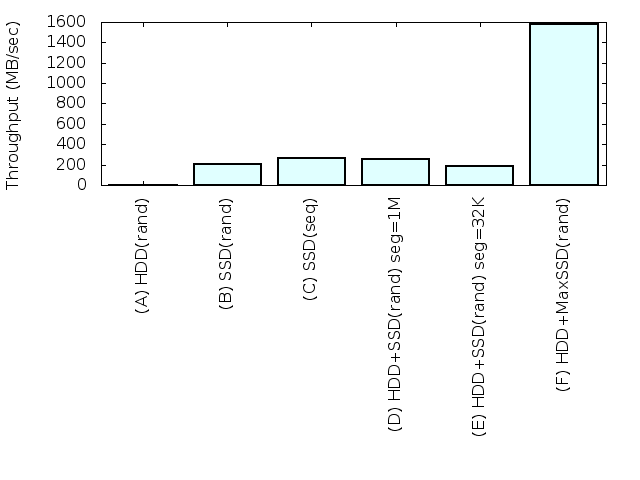

# Performance
This directory posesses several benchmark programs
and documents.

## Environment
Experimental results are
all measured on my computer with commodity components.

Features are as follows,  

- CPU: Intel core i7-3770  
- RAM: 32GB  
- SSD: Samsung 840 Pro (256GB)  
- HDD: Seagate 
- Kernel Version: 3.9.8  

## (1) Measuring throughput by fio tool
The objective of this experiment is to
measure the maximun write throughput
on several combinations of devices
and configurations.

The base fio script is shown below
which is what competitor cache softwares
are examined in.

```
[global]
filename=/dev/mapper/perflv
randrepeat=1
ioengine=libaio
bs=4k
ba=4k
size=16GB
direct=1
gtod_reduce=1
norandommap
iodepth=64
stonewall

[perf]
rw=randwrite
```

And the results are,



<table>
 <tr>
  <th>Type</th><th>Throughput (MB/sec)</th>
 </tt>
 <tr>
  <td>(A) HDD(rand)</td><td>0.883</td>
 </tr>
 <tr>
  <td>(B) SSD(rand)</td><td>202</td>
 </tr>
 <tr>
  <td>(C) SSD(seq)</td><td>266</td>
 </tr>
 <tr>
  <td>(D) HDD+SSD(rand) seg=1M</td><td>259</td>
 </tr>
 <tr>
  <td>(E) HDD+SSD(rand) seg=32K</td><td>184</td>
 </tr>
 <tr>
  <td>(F) HDD+MaxSSD(rand)</td><td>1579</td>
 </tr>
</table>

Discussion,

- (A) This is a typical result of 2.5 inch HDD. It is very slow.
RAID is a technique to parallelize number of devices for
reliability and throughput but the shortcoming is RAID penalty.
The write is relatively slow than read in RAID-ed storage system.
This is also why dm-lc is desired.  
- (B) Samsung's firmware is very smart. This is 76% of
the sequential throughput shown in (C).  
- (C) fio configuration is change to write
sequentially by 1MB for each write.
Although Samsung's official specification sheet
says that write throughput is 520MB/s but
the result is different in my experiment.  
- (D) A dominant performance factor in dm-lc configuration
is the size of segment. segment is the container for each log buffer.
The bigger the buffer is, the throughput is likely to be higher
because of these reason one, it decreases the overhead to create log
and two, writes granurality onto SSD cache device is bigger.
The result 259 MB/sec only loses 3% throughput
compared to the sequetial throughput of the cache device 266 MB/sec 
which is shown (C). This result shows that 
the CPU overhead is very small because the implementation
of dm-lc is very compact and sophisticated.  
- (E) The applications in reality often submit sync writes
which lead to embarrassing bios with REQ_FUA ro REQ_FLUSH flags.
The size of segment is in tradeoff. The bigger the segment is
, the maximun write throughput is bigger but on the other hand
performance is likely to get worse by these sorts of bios.
Segment size is set to 32KB which is enough small and
the throughput decreases to 184 MB/sec from 259 MB/sec
with 1MB segment size. I think this is not bad for real application
however still needs some improvements is for sure.  
- (F) In my environment, the SSD is not so fast.
There existing PCI-e SSD devices that performs
more than 1 GB/sec write throughput like ioDrive.
Because the relation between RAM buffer and the SSD device
in dm-lc is like stream processing,
we can assume the theoritical maximum throughput
with a fast enough cache device in imagination which
we call MaxSSD.
The result is 1579 MB/s that is unimaginably fast.
I hope someone examine this result in reality using
PCI-e SSD. I am personally doing this research and
I have no enough money to buy that.
